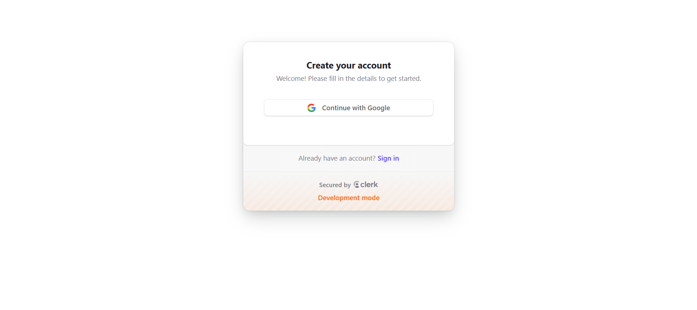
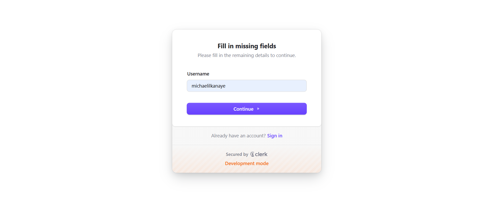
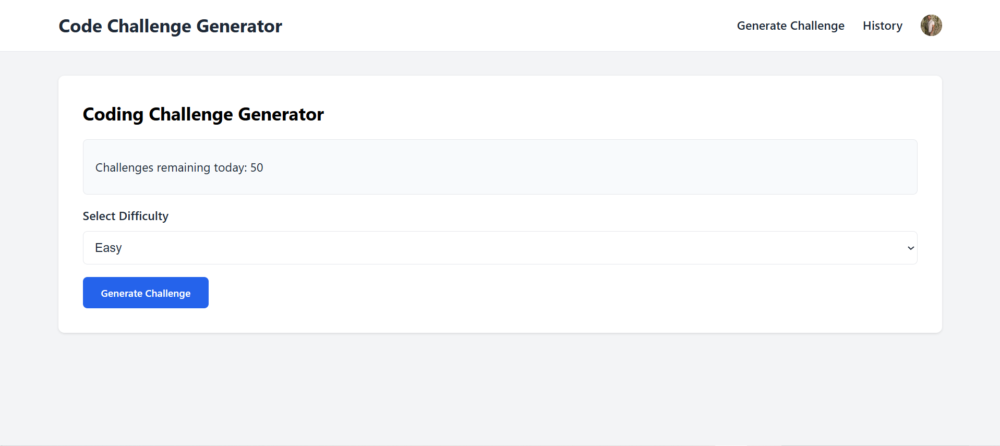
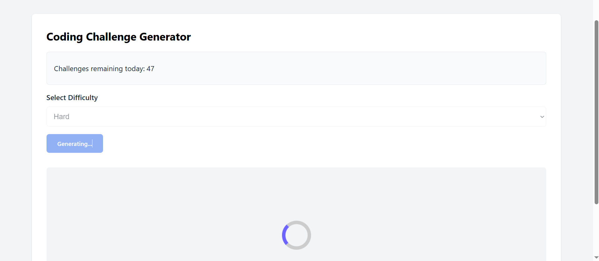
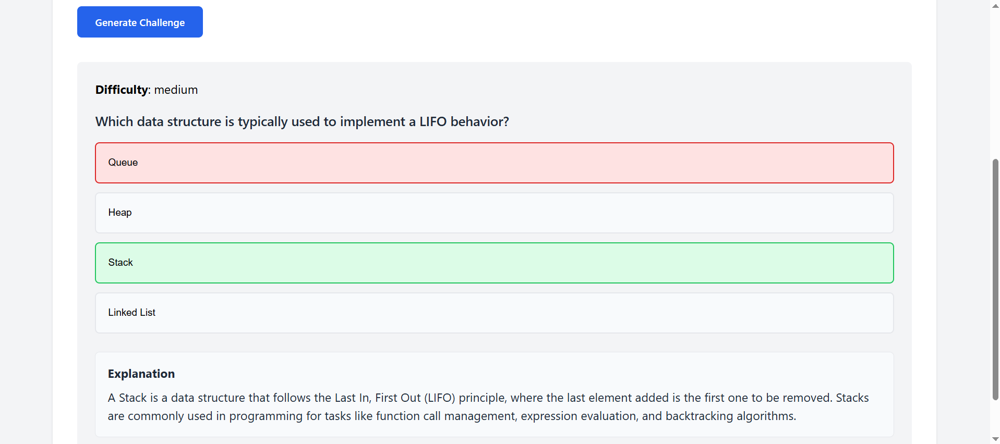
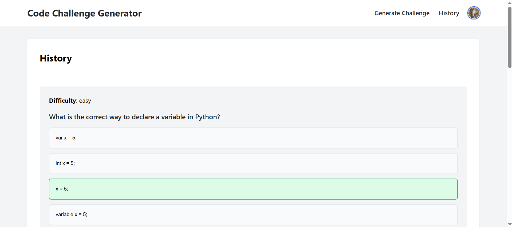

# DevQuiz-AI

A full-stack **AI-powered coding quiz generator** built with **FastAPI**, **React**, **Clerk Auth**, and **OpenAI's LLMs**.

This app allows authenticated users to generate and solve multiple-choice code challenges dynamically.


## 📸 Screenshots

<table>
  <tr>
    <td align="center" valign="top">
      
      <p><strong>Login / Signup</strong></p>
    </td>
    <td align="center" valign="top">
      
      <p><strong>User Name</strong></p>
    </td>
  </tr>
  <tr>
    <td align="center" valign="top">
      
      <p><strong>Generate Challenge</strong></p>
    </td>
    <td align="center" valign="top">
      
      <p><strong>Generate Challenge</strong></p>
    </td>
  </tr>
  <tr>
    <td align="center" valign="top">
      
      <p><strong>Challenge</strong></p>
    </td>
    <td align="center" valign="top">
      
      <p><strong>History</strong></p>
    </td>
  </tr>
</table>


---

## 🚀 Features

- 🔐 **User Authentication** — Fully managed with Clerk (JWTs + secure sessions)
- ⚙️ **Backend API** — FastAPI-based, fully async REST API
- 💡 **AI-Powered Challenges** — Uses OpenAI to generate dynamic coding quizzes
- 🗄️ **Database Integration** — SQLAlchemy ORM and Pydantic for validation
- 💻 **Frontend** — Built with React and Vite
- 🔗 **Clerk Webhooks** — Sync user events to the backend

---

## 🛠️ Tech Stack

| Layer           | Technology                    | Purpose                                              |
|----------------|--------------------------------|------------------------------------------------------|
| **Frontend**    | React, Vite, JavaScript        | UI components, routing, user interaction             |
| **Backend**     | FastAPI, Uvicorn, Pydantic, Python     | RESTful API, data validation, async logic            |
| **Authentication** | Clerk.dev                   | User signup, JWT auth, session handling              |
| **AI Engine**   | OpenAI API                     | Quiz generation using GPT models                     |
| **Database**    | SQLAlchemy ORM + SQLite        | Persistent storage and schema modeling               |
| **Tooling**     | dotenv, Ngrok (dev only)       | Environment configs and webhook tunneling            |

> 🔧 **Note**: Ngrok is only required in development to expose the local backend for **Clerk Webhooks**.

---

## 📦 Installation & Setup

Clone the repository:

```bash
git clone https://github.com/michaelilkanayev1997/DevQuiz-ai.git
cd DevQuiz-ai

cd backend
uv pip install -r pyproject.toml
uvicorn main:app --reload

cd ../client
npm install
npm run dev

ngrok http 8000
